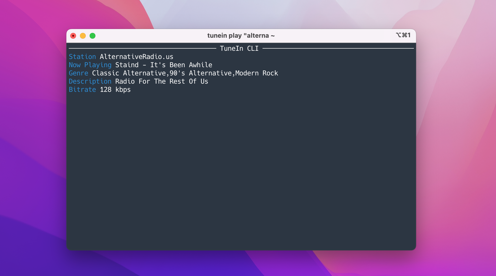
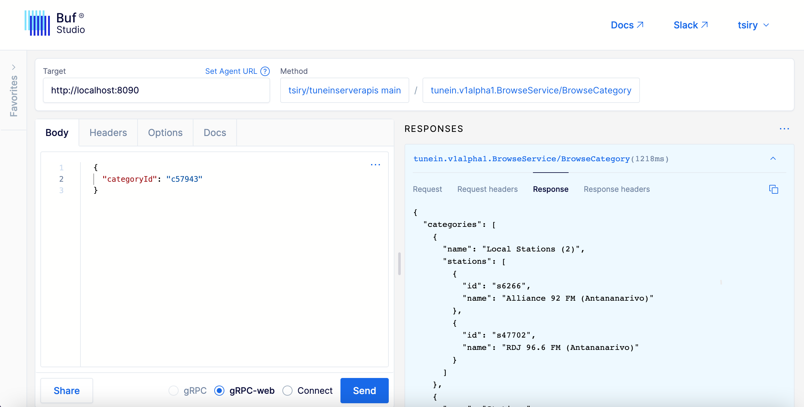

# TuneIn CLI 📻 🎵 ✨

<p>
  <a href="https://flakehub.com/flake/tsirysndr/tunein-cli" target="_blank">
    
  </a>
  <a href="https://crates.io/crates/tunein-cli" target="_blank">
    
  </a>
  <a href="https://flakestry.dev/flake/github/tsirysndr/tunein-cli" target="_blank">
    
  </a>
  <a href="https://crates.io/crates/tunein-cli" target="_blank">
    
  </a>
  <a href="#"
    
  </a>
  <a href="LICENSE" target="./LICENSE">
    
  </a>
  <a href="https://github.com/tsirysndr/tunein-cli/actions/workflows/ci.yml">
    
</p>

A command line interface for [TuneIn Radio](https://tunein.com) / [Radio Browser](https://www.radio-browser.info/).<br />
You can search for stations, play them, and see what's currently playing.


## 🚚 Installation

Compile from source, without Nix:

```bash
# Install dependencies
brew install protobuf # macOS
sudo apt-get install -y libasound2-dev protobuf-compiler # Ubuntu/Debian
# Compile and install
git clone https://github.com/tsirysndr/tunein-cli
cd tunein-cli
cargo install --path .
```

With Nix:

```bash
git clone https://github.com/tsirysndr/tunein-cli
cd tunein-cli
nix develop --experimental-features "nix-command flakes"
cargo install --path .
```

### macOS/Linux

Using Bash:

```bash
curl -fsSL https://cdn.jsdelivr.net/gh/tsirysndr/tunein-cli@ab6a1ab/install.sh | bash
```

Using [Homebrew](https://brew.sh):

```bash
brew install tsirysndr/tap/tunein
```

Using [Nix](https://nixos.org/nix/):

```bash
cachix use tsirysndr
nix profile install --experimental-features "nix-command flakes" github:tsirysndr/tunein-cli
```

### Ubuntu/Debian

```bash
echo "deb [trusted=yes] https://apt.fury.io/tsiry/ /" | sudo tee /etc/apt/sources.list.d/fury.list
sudo apt-get update
sudo apt-get install tunein-cli
```

### Fedora

Add the following to `/etc/yum.repos.d/fury.repo`:

```
[fury]
name=Gemfury Private Repo
baseurl=https://yum.fury.io/tsiry/
enabled=1
gpgcheck=0
```

Then run:
```bash
dnf install tunein-cli
```

### Arch Linux
Using [paru](https://github.com/Morganamilo/paru):

```bash
paru -S tunein-cli-bin
```

Or download the latest release for your platform [here](https://github.com/tsirysndr/tunein-cli/releases).

## 📦 Downloads
- `Mac`: arm64: [tunein_v0.3.1_aarch64-apple-darwin.tar.gz](https://github.com/tsirysndr/tunein-cli/releases/download/v0.3.1/tunein_v0.3.1_aarch64-apple-darwin.tar.gz) intel: [tunein_v0.3.1_x86_64-apple-darwin.tar.gz](https://github.com/tsirysndr/tunein-cli/releases/download/v0.3.1/tunein_v0.3.1_x86_64-apple-darwin.tar.gz)
- `Linux`: [tunein_v0.3.1_x86_64-unknown-linux-gnu.tar.gz](https://github.com/tsirysndr/tunein-cli/releases/download/v0.3.1/tunein_v0.3.1_x86_64-unknown-linux-gnu.tar.gz)

## 🚀 Usage
```
USAGE:
    tunein <SUBCOMMAND>

OPTIONS:
    -h, --help                   Print help information
    -p, --provider <provider>    The radio provider to use, can be 'tunein' or 'radiobrowser'.
                                 Default is 'tunein' [default: tunein]
    -V, --version                Print version information

SUBCOMMANDS:
    browse    Browse radio stations
    help      Print this message or the help of the given subcommand(s)
    play      Play a radio station
    search    Search for a radio station
    server    Start the server
    service   Manage systemd service for tunein-cli server
```

Search for a radio station:
```bash
tunein search "BBC Radio 1"
```
Result:
```
BBC Radio 1 | The best new music | id: s24939
BBC Radio 1Xtra | Remi Burgz | id: s20277
```

Play a radio station:
```bash
tunein play "alternativeradio.us"
# Or by station ID
tunein play s221580
```

## 🧙 Systemd Service

Tunein daemon can be started as a systemd service. To enable and start the service, run the following command:

```bash
tunein service install
```

To disable and stop the service, run the following command:

```bash
tunein service uninstall
```

To check the status of the service, run the following command:

```bash
tunein service status
```


## API Documentation
[https://buf.build/tsiry/tuneinserverapis/docs/main:tunein.v1alpha1](https://buf.build/tsiry/tuneinserverapis/docs/main:tunein.v1alpha1)

You can start the server locally by running:
```bash
tunein server
```

and then use [Buf Studio](https://studio.buf.build/tsiry/tuneinserverapis?selectedProtocol=grpc-web&target=http%3A%2F%2Flocalhost%3A8090) to make requests to the server




## 📝 License
[MIT](LICENSE)
