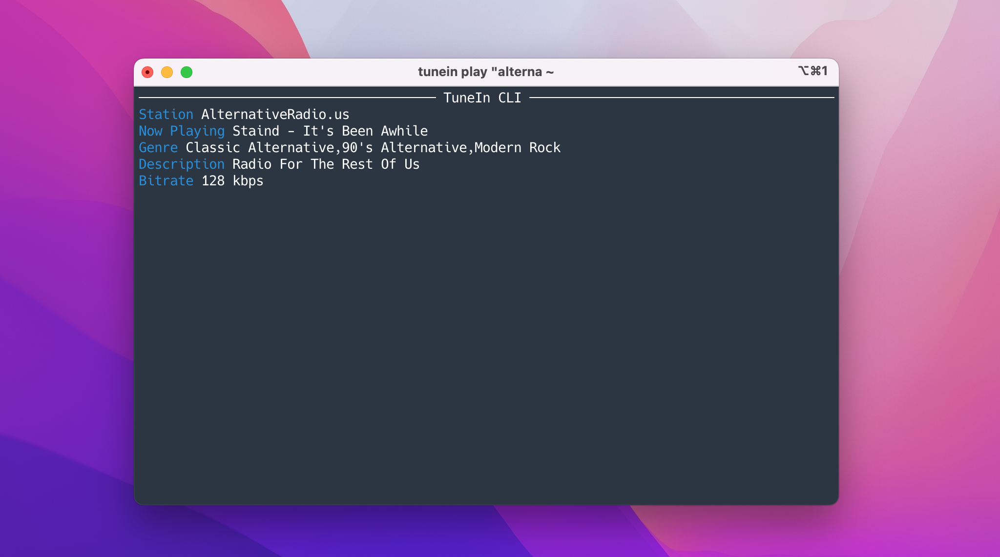
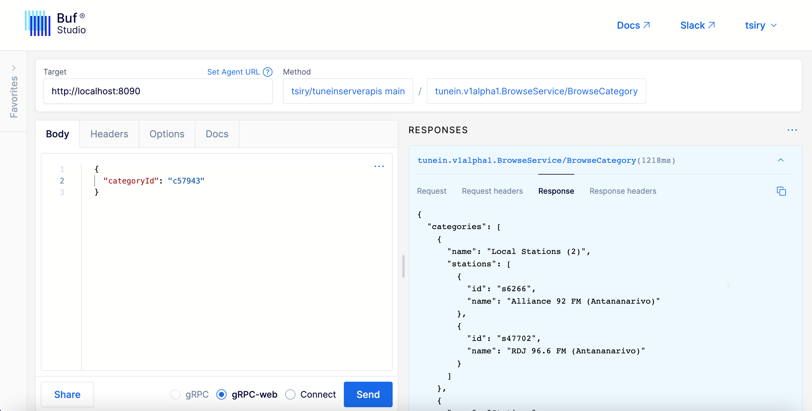

# TuneIn CLI 📻 🎵 ✨

<p>
  <a href="https://flakehub.com/flake/tsirysndr/tunein-cli" target="_blank">
    
  </a>
  <a href="https://crates.io/crates/tunein-cli" target="_blank">
    
  </a>
  <a href="https://crates.io/crates/tunein-cli" target="_blank">
    
  </a>
  <a href="#">
    
  </a>
  <a href="LICENSE" target="./LICENSE">
    
  </a>
  <a href="https://github.com/tsirysndr/tunein-cli/actions/workflows/ci.yml">
    
  </a>
</p>

A command line interface for [TuneIn Radio](https://tunein.com) / [Radio Browser](https://www.radio-browser.info/).<br />
You can search for stations, play them, and see what's currently playing.


## 📖 Table of Contents

- [Features](#-features)
- [Installation](#-installation)
- [Downloads](#-downloads)
- [Usage](#-usage)
- [Equalizer](#-equalizer)
- [Keyboard Shortcuts](#-keyboard-shortcuts)
- [Web UI & GraphQL API](#-web-ui--graphql-api)
- [Systemd Service](#-systemd-service)
- [API Documentation](#api-documentation)
- [License](#-license)

## ✨ Features

- 🔍 Search and play thousands of radio stations from [TuneIn](https://tunein.com) or [Radio Browser](https://www.radio-browser.info/)
- 🎵 Plays all the common Icecast stream formats: **MP3, AAC/AAC+, Ogg Vorbis, FLAC and WAV** (decoded with [Symphonia](https://github.com/pdeljanov/Symphonia))
- 🎧 Powerful DSP (**Equalizer, Bass, Treble**) based on the [Rockbox DSP](https://github.com/tsirysndr/rockboxd/tree/master/crates/rockbox-dsp) engine
- 📻 Interactive TUI: browse categories, favourites, resume last station
- 🌈 Real-time audio visualizations: oscilloscope, vectorscope and spectroscope
- 🖥️ OS media controls integration (play/pause/volume from your keyboard's media keys)
- 🛰️ Built-in gRPC server, installable as a systemd service
- 🌐 Embedded web UI with a GraphQL API (`tunein web`) — search, browse and listen from your browser

## 🚚 Installation

Compile from source, without Nix:

```bash
# Install dependencies
brew install protobuf # macOS
sudo apt-get install -y libasound2-dev protobuf-compiler libdbus-1-dev # Ubuntu/Debian
# Compile and install
git clone https://github.com/tsirysndr/tunein-cli
cd tunein-cli
cargo install --path .
```

With Nix:

```bash
git clone https://github.com/tsirysndr/tunein-cli
cd tunein-cli
nix develop --experimental-features "nix-command flakes"
cargo install --path .
```

### macOS/Linux

Using Bash:

```bash
curl -fsSL https://cdn.jsdelivr.net/gh/tsirysndr/tunein-cli@ab6a1ab/install.sh | bash
```

Using [Homebrew](https://brew.sh):

```bash
brew install tsirysndr/tap/tunein
```

Using [Nix](https://nixos.org/nix/):

```bash
cachix use tsirysndr
nix profile install --experimental-features "nix-command flakes" github:tsirysndr/tunein-cli
```

### Ubuntu/Debian

```bash
echo "deb [trusted=yes] https://apt.fury.io/tsiry/ /" | sudo tee /etc/apt/sources.list.d/fury.list
sudo apt-get update
sudo apt-get install tunein-cli
```

### Fedora

Add the following to `/etc/yum.repos.d/fury.repo`:

```
[fury]
name=Gemfury Private Repo
baseurl=https://yum.fury.io/tsiry/
enabled=1
gpgcheck=0
```

Then run:
```bash
dnf install tunein-cli
```

### Arch Linux
Using [paru](https://github.com/Morganamilo/paru):

```bash
paru -S tunein-cli-bin
```

Or download the latest release for your platform [here](https://github.com/tsirysndr/tunein-cli/releases).

## 📦 Downloads
- `Mac`: arm64: [tunein_v0.5.0_aarch64-apple-darwin.tar.gz](https://github.com/tsirysndr/tunein-cli/releases/download/v0.5.0/tunein_v0.5.0_aarch64-apple-darwin.tar.gz) intel: [tunein_v0.5.0_x86_64-apple-darwin.tar.gz](https://github.com/tsirysndr/tunein-cli/releases/download/v0.5.0/tunein_v0.5.0_x86_64-apple-darwin.tar.gz)
- `Linux`: [tunein_v0.5.0_x86_64-unknown-linux-gnu.tar.gz](https://github.com/tsirysndr/tunein-cli/releases/download/v0.5.0/tunein_v0.5.0_x86_64-unknown-linux-gnu.tar.gz)

## 🚀 Usage
```
USAGE:
    tunein <SUBCOMMAND>

OPTIONS:
    -h, --help                   Print help information
    -p, --provider <provider>    The radio provider to use, can be 'tunein' or 'radiobrowser'.
                                 Default is 'tunein' [default: tunein]
    -V, --version                Print version information

SUBCOMMANDS:
    browse    Browse radio stations
    help      Print this message or the help of the given subcommand(s)
    play      Play a radio station
    search    Search for a radio station
    server    Start the server
    service   Manage systemd service for tunein-cli server
    web       Start the web UI & GraphQL API server
```

Search for a radio station:
```bash
tunein search "BBC Radio 1"
```
Result:
```
BBC Radio 1 | The best new music | id: s24939
BBC Radio 1Xtra | Remi Burgz | id: s20277
```

Play a radio station:
```bash
tunein play "alternativeradio.us"
# Or by station ID
tunein play s221580
```

## 🎧 Equalizer

TuneIn CLI ships a powerful DSP (Equalizer, Bass, Treble) based on the [Rockbox DSP](https://github.com/tsirysndr/rockboxd/tree/master/crates/rockbox-dsp) engine. Press `e` while playing (or anywhere in interactive mode) to open the equalizer popup: a **10-band graphic equalizer** plus **Bass** and **Treble** shelf controls.

| Key       | Action                                               |
| --------- | ---------------------------------------------------- |
| `e`       | Open / close the equalizer                           |
| `←` / `→` | Select a band (or Bass / Treble)                     |
| `↑` / `↓` | Adjust the selected gain (`Shift` for coarse steps)  |
| `Space`   | Toggle the equalizer on / off                        |
| `0`       | Reset all gains to 0 dB                              |
| `Esc`     | Close the popup                                      |

### Bass & Treble

The Bass and Treble columns control Rockbox-style shelf filters (±24 dB, in whole-dB steps). Following Rockbox semantics they are **independent of the equalizer on/off switch**: any non-zero value is applied even when the band EQ is off. The shelf cutoffs default to 200 Hz (bass) and 3.5 kHz (treble) and can be changed in the settings file.

### Settings

Every change is saved immediately to `settings.toml` in the config directory (`~/Library/Application Support/io.tunein-cli.tunein-cli/` on macOS, `~/.config/tunein-cli/` on Linux). The schema matches Rockbox's `settings.toml`, so EQ presets round-trip between the two:

```toml
eq_enabled = true
bass = 4        # dB, shelf filter, independent of eq_enabled
treble = -2     # dB
bass_cutoff = 0   # Hz, 0 = default (200)
treble_cutoff = 0 # Hz, 0 = default (3500)

[[eq_band_settings]]
cutoff = 32 # Hz
q = 7       # Q × 10 (0.7)
gain = 30   # dB × 10 (+3.0 dB)

# … 9 more [[eq_band_settings]] entries (63, 125, 250, 500, 1k, 2k, 4k, 8k, 16k)
```

## 🎹 Keyboard Shortcuts

Press `?` in either UI to see every available shortcut with a description. Highlights:

| Key            | Player              | Interactive mode       |
| -------------- | ------------------- | ---------------------- |
| `Space`        | Play / pause        | Toggle EQ (in popup)   |
| `Tab`          | Cycle visualization | —                      |
| `↑` / `↓`      | Volume              | Navigate lists         |
| `e`            | Equalizer           | Equalizer              |
| `f`            | —                   | Add / remove favourite |
| `x`            | —                   | Stop playback          |
| `+` / `-`      | —                   | Volume                 |
| `?`            | Help                | Help                   |
| `q` / `Ctrl+C` | Quit                | Quit (`Ctrl+C`)        |

## 🌐 Web UI & GraphQL API

TuneIn CLI ships a modern dark-themed web interface — an internet radio player and browser — served together with a GraphQL API from a single embedded [Actix](https://actix.rs) server:

```bash
tunein web          # listens on http://localhost:8091
tunein web 3000     # custom port
```

- **Web UI**: [http://localhost:8091](http://localhost:8091) — instant search, category browsing, provider switching (TuneIn / Radio Browser) and a persistent player with live "now playing" metadata.
- **GraphQL playground**: [http://localhost:8091/graphql](http://localhost:8091/graphql) (GraphiQL); POST your queries to the same endpoint.

The frontend lives in [`web/`](./web) and is embedded into the binary at compile time — see [web/README.md](./web/README.md) for the stack, development workflow and GraphQL API reference.

## 🧙 Systemd Service

Tunein daemon can be started as a systemd service. To enable and start the service, run the following command:

```bash
tunein service install
```

To disable and stop the service, run the following command:

```bash
tunein service uninstall
```

To check the status of the service, run the following command:

```bash
tunein service status
```


## API Documentation
[https://buf.build/tsiry/tuneinserverapis/docs/main:tunein.v1alpha1](https://buf.build/tsiry/tuneinserverapis/docs/main:tunein.v1alpha1)

You can start the server locally by running:
```bash
tunein server
```

and then use [Buf Studio](https://studio.buf.build/tsiry/tuneinserverapis?selectedProtocol=grpc-web&target=http%3A%2F%2Flocalhost%3A8090) to make requests to the server




## 📝 License
[MIT](LICENSE)
